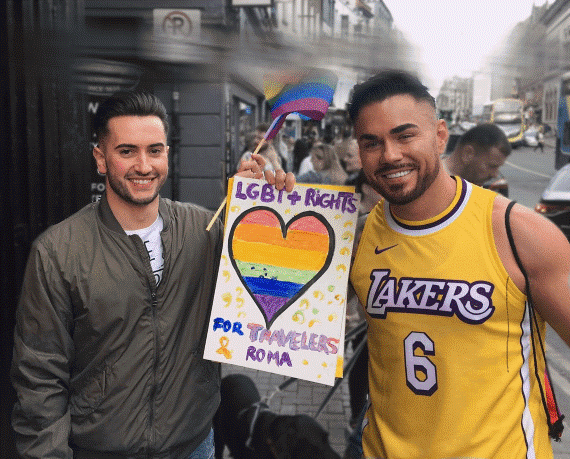

+++
title = "Get Information and Support"
+++

# Get Information & Support

##### We have a variety of empowering resources, helpful guides, useful information and links to other organisations & more support for you. 

##### And if you like to [talk to us personally](/contact), give our Key Worker a ring or write her a message.

## Find Help & Support

Find support at LGBT+ Traveller & Roma friendly Traveller and LGBT+ organisations who offer a non-judgmental ear to you or provide information...

...or contact the [Traveller Counselling Service](https://travellercounselling.ie/) or [Exchange House Ireland](https://www.exchangehouse.ie/services.php) and make an appointment with a counsellor!

## Advice & Guides

We are currently working with a group of LGBTI+ Traveller & Roma to develop guides on 

**Coming Out** 

**Mental Health**

**Physical Health**.

## Resources

Download the **LGBT+ Traveller & Roma Calendar** or our **LGBTI+ Traveller & Roma Pride Poster** and share it with your community. 

[Download the 2022 LGBTI+ Traveller & Roma Calendar](2022-Calendar-LGBTI-Traveller-Roma.pdf)

[Download the LGBTI+ Traveller & Roma Pride Poster](relaunchposter.pdf)

## For Parents & Carers

For Parents & Carers: If you are a parent or carer of an LGBTI+ Traveller or Roma or you think your child might be LGBTI+ you find some advice and resources [here](/for-parents). 

## Peer-Research Unveiling Inequality

COMING SOON Peer-Research Report Unveiling Inequality - Experiences of LGBTI+ Travellers and Roma.

[Find out more](/what-we-do/research)